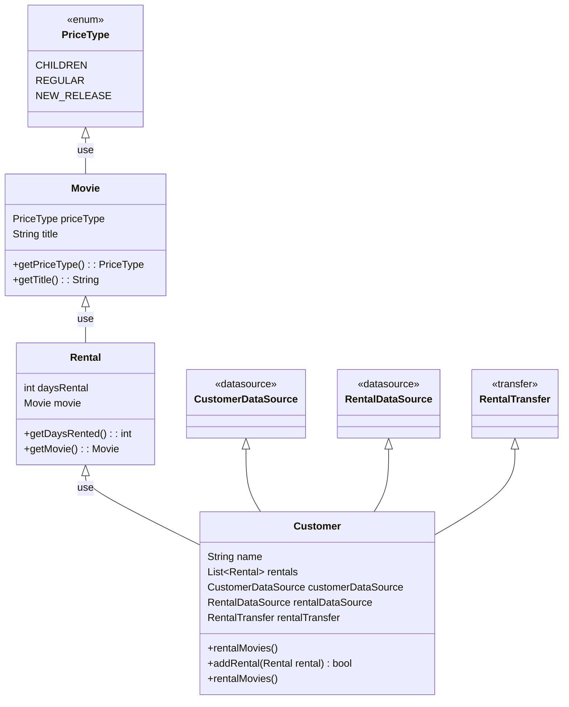

## レンタルビデオの料金、レンタルポイントの計算モデル

- レンタルビデオには`旧作`、`新作`、`子供用作品` の3種類がある
- 種類による料金とレンタルポイントの設定

| 種類     | 料金                        | レンタルポイント                 |
|--------|---------------------------|--------------------------|
| 旧作     | 基本料金　$2<br>3日目から $1.5/日   | 1ポイント                    |
| 新作     | $3/日                      | 1ポイント<br>二日以上借りた場合は2ポイント |
| 子供用作品　 | 基本料金　$1.5<br>4日目から $1.5/日 | 1ポイント                    |

### レンタル業務
1. レンタル料金の計算
2. レンタルポイントの計算
3. 顧客名、合計料金の記録
4. レンタル作品の記録
5. レンタルポイントの記録
6. レンタルの通知


### 最初のモデル


Customer.java
https://github.com/stgctkm/UniteTesting/blob/c61c1b0fc9c916b2c9446a5a27f8ba457166a4aa/src/main/java/video/domain/Customer.java

```java
public class Customer {
    private String name;
    private List<Rental> rentals = new ArrayList<>();

    RentalDataSource rentalDataSource = new RentalDataSource();
    CustomerDataSource customerDataSource = new CustomerDataSource();
    RentalNotificationTransfer rentalNotificationTransfer = new RentalNotificationTransfer();

    public Customer(String name) {
        this.name = name;
    }

    public void addRental(Rental rental) {
        rentals.add(rental);
    }

    public String getName() {
        return name;
    }

    public int rentalMovies() {
        double totalAmount = 0;
        int frequentRenterPoints = 0;
        for (Rental each : rentals) {
            double thisAmount = 0;
            // 一行ごとに金額を計算
            switch (each.getMovie().getPriceType()) {
                case REGULAR:
                    thisAmount += 2;
                    if (each.getDaysRented() > 2)
                        thisAmount += (each.getDaysRented() - 2) * 1.5;
                    break;
                case NEW_RELEASE:
                    thisAmount += each.getDaysRented() * 3;
                    break;
                case CHILDREN:
                    thisAmount += 1.5;
                    if (each.getDaysRented() > 3)
                        thisAmount += (each.getDaysRented() - 3) * 1.5;
                    break;
            }
            // レンタルポイントを加算
            frequentRenterPoints++;
            // 新作を二日以上借りた場合はボーナスポイント
            if ((each.getMovie().getPriceType() == PriceType.NEW_RELEASE) &&
                each.getDaysRented() > 1) frequentRenterPoints++;
            totalAmount += thisAmount;
        }

        // レンタルの記録
        int rentalId = rentalDataSource.registerRental(name, rentals, totalAmount);

        // レンタルポイントの記録
        customerDataSource.registerRentalPoint(name, frequentRenterPoints);

        // レンタルの通知
        rentalNotificationTransfer.notice(name, rentals);

        return rentalId;
    }
}
```

Movie.java
```java
public class Movie {

    private String title;
    PriceType priceType;

    public Movie(String title, PriceType priceType) {
        this.title = title;
        this.priceType = priceType;
    }

    public PriceType getPriceType() {
        return priceType;
    }

    public void setPriceType(PriceType priceType) {
        this.priceType = priceType;
    }

    public String getTitle() {
        return title;
    }
}
```
Rental.java
```java
public class Rental {
    private Movie movie;
    private int daysRented;

    public Rental(Movie movie, int daysRented) {
        this.movie = movie;
        this.daysRented = daysRented;
    }

    public int getDaysRented() {
        return daysRented;
    }

    public Movie getMovie() {
        return movie;
    }
}
```

PriceType.java
```java
public enum PriceType {
    CHILDREN,
    REGULAR,
    NEW_RELEASE
}
```