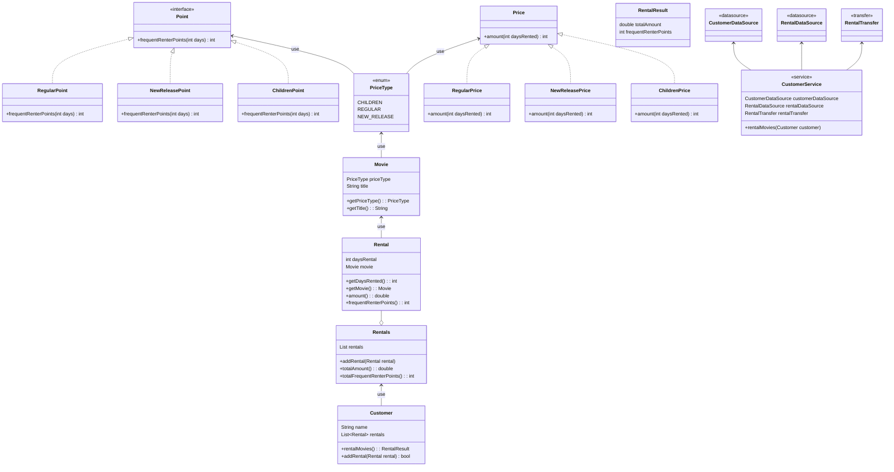

# レンタルポイントのリファクタリングのクラス図.md

```mermaid
classDiagram
    class Point {
        +frequentRenterPoints(int days) int
    }
    class RegularPoint {
        +frequentRenterPoints(int days) int
    }
    class NewReleasePoint {
        +frequentRenterPoints(int days) int
    }
    class ChildrenPoint {
         +frequentRenterPoints(int days) int
    }
    class Price {
        +amount(int daysRented) int
    }
    class RegularPrice {
        +amount(int daysRented) int
    }
    class NewReleasePrice {
        +amount(int daysRented) int
    }
    class ChildrenPrice {
         +amount(int daysRented) int
    }
    
    class Customer{
        String name
        List~Rental~ rentals
        +rentalMovies(): RentalResult
        +addRental(Rental rental) bool
    }

    class Rental {
        int daysRental
        Movie movie
        +getDaysRented(): int
        +getMovie(): Movie
        +amount(): double
        +frequentRenterPoints(): int
    }

    class Movie {
        PriceType priceType
        String title
        +getPriceType(): PriceType
        +getTitle(): String
    }

    class PriceType {
        CHILDREN
        REGULAR
        NEW_RELEASE
    }

    class CustomerService {
        CustomerDataSource customerDataSource
        RentalDataSource rentalDataSource
        RentalTransfer rentalTransfer
        +rentalMovies(Customer customer)
    }

    class RentalResult {
        double totalAmount
        int frequentRenterPoints
    }
    class Rentals {
        List<Rental> rentals
        +addRental(Rental rental)
        +totalAmount(): double
        +totalFrequentRenterPoints(): int
    }

Point <|.. RegularPoint
Point <|.. NewReleasePoint
Point <|.. ChildrenPoint

Point <-- PriceType: use
Price <-- PriceType: use


Price <|.. RegularPrice
Price <|.. NewReleasePrice
Price <|.. ChildrenPrice


PriceType <-- Movie: use
Rentals <-- Customer: use
Movie <-- Rental : use
Rental --o Rentals
CustomerDataSource <-- CustomerService
RentalDataSource <-- CustomerService
RentalTransfer <-- CustomerService

<<enum>> PriceType
<<interface>> Point
<<datasource>> CustomerDataSource
<<datasource>> RentalDataSource
<<transfer>> RentalTransfer
<<service>> CustomerService
```
