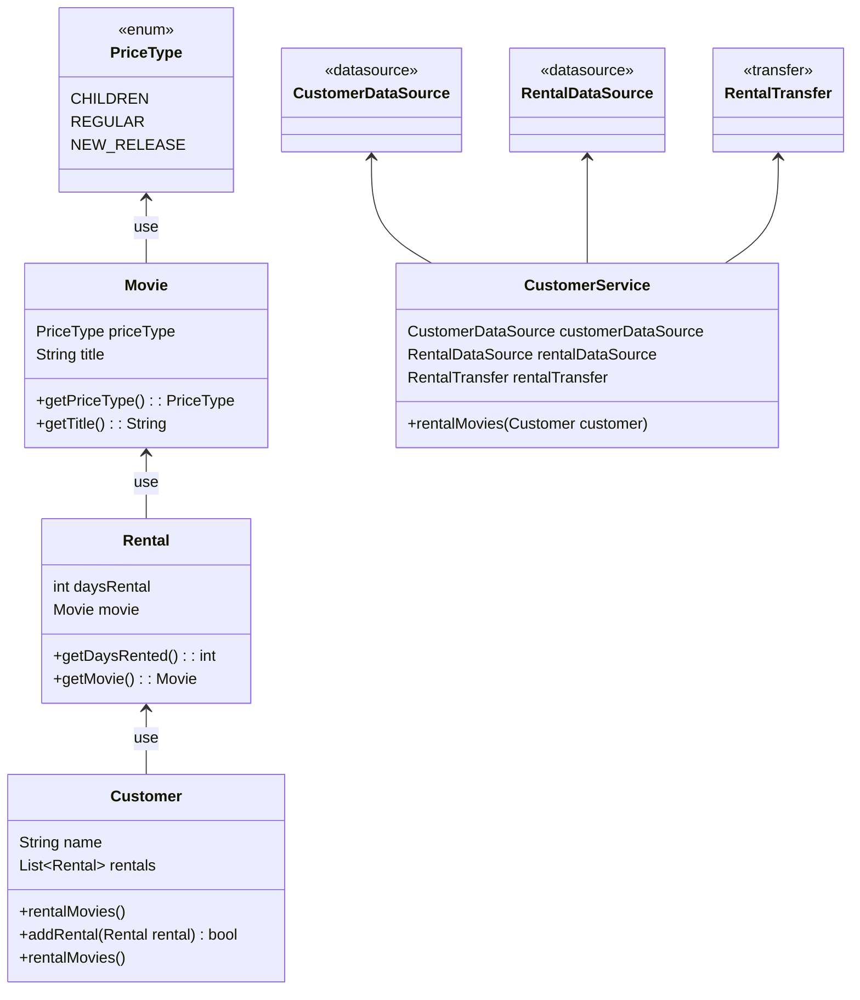

# クラス図

```mermaid
classDiagram
    class Customer{
        String name
        List~Rental~ rentals
        +rentalMovies()
        +addRental(Rental rental) bool
        +rentalMovies()
    }

    class Rental {
        int daysRental
        Movie movie
        +getDaysRented(): int
        +getMovie(): Movie
    }

    class Movie {
        PriceType priceType
        String title
        +getPriceType(): PriceType
        +getTitle(): String
    }

    class PriceType {
        CHILDREN
        REGULAR
        NEW_RELEASE
    }

    class CustomerService {
        CustomerDataSource customerDataSource
        RentalDataSource rentalDataSource
        RentalTransfer rentalTransfer
        +rentalMovies(Customer customer)
    }

PriceType <-- Movie: use
Rental <-- Customer: use
Movie <-- Rental : use
CustomerDataSource <-- CustomerService
RentalDataSource <-- CustomerService
RentalTransfer <-- CustomerService

 <<enum>> PriceType
 <<datasource>> CustomerDataSource
 <<datasource>> RentalDataSource
 <<transfer>> RentalTransfer
```
