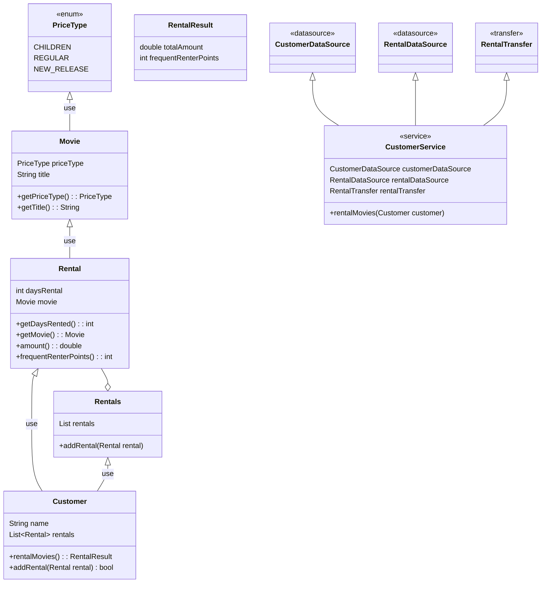

# クラス図

```mermaid
classDiagram
    class Customer{
        String name
        List~Rental~ rentals
        +rentalMovies(): RentalResult
        +addRental(Rental rental) bool
    }

    class Rental {
        int daysRental
        Movie movie
        +getDaysRented(): int
        +getMovie(): Movie
        +amount(): double
        +frequentRenterPoints(): int
    }

    class Movie {
        PriceType priceType
        String title
        +getPriceType(): PriceType
        +getTitle(): String
    }

    class PriceType {
        CHILDREN
        REGULAR
        NEW_RELEASE
    }

    class CustomerService {
        CustomerDataSource customerDataSource
        RentalDataSource rentalDataSource
        RentalTransfer rentalTransfer
        +rentalMovies(Customer customer)
    }

    class RentalResult {
        double totalAmount
        int frequentRenterPoints
    }
    class Rentals {
        List<Rental> rentals
        +addRental(Rental rental)
    }

PriceType <|-- Movie: use
Rental <|-- Customer: use
Rentals <|-- Customer: use
Movie <|-- Rental : use
Rental --o Rentals
CustomerDataSource <|-- CustomerService
RentalDataSource <|-- CustomerService
RentalTransfer <|-- CustomerService

 <<enum>> PriceType
 <<datasource>> CustomerDataSource
 <<datasource>> RentalDataSource
 <<transfer>> RentalTransfer
<<service>> CustomerService
```
